## DEVIS RedsFin ERP

### Documentation

---

DEVIS RedsFin ERP adalah sebuah ERP sistem terpadu yang dikembangkan untuk mendukung operasional dan manajemen perusahaan PT Devis Jaya Advertising.

Adapun modul-modul yang tercakup pada DEVIS RedsFin ERP ini terdiri dari:

1. [Master Data](#1-master-data)
2. [Sales](#2-sales)
3. Procurement
4. [Production](#4-production)
5. Inventory
6. [Site Development & Permit](#6-site-development--permit)
7. Marketing
8. Finance Accounting
9. Reporting & Dashboard

---

### 1. Master Data

Master Data berisi semua data master (list/daftar dari komponen entitas) yang berhubungan dengan entitas atau komponen bisnis yang digunakan oleh sistem ERP. Segala entitas dan komponen yang digunakan dalam pencatatan transaksi atau aktivitas bisnis akan didaftarkan pada bagian **Master Data**.

Adapun list/daftar yang tercakup dalam **Master Data** adalah sebagai berikut:

- [Entity](#11-entity)
- [User Management](#12-user-management)
- [Master Site Development & Permit](#13-master-site-development--permit)
- [Master Devis](#14-master-devis)
- [Master Procurement](#15-master-procurement)
- [Master Sales](#16-master-sales)
- [Master Production](#17-master-production)
- [Master Marketing](#18-master-marketing)

---

#### 1.1. Entity

Master Entity adalah master yang berisikan daftar yang berkaitan dengan Perusahaan PT Devis Jaya Advertising. Master Entity terdiri dari:

| Menu              | Keterangan                                |
| ----------------- | ----------------------------------------- |
| Master Company    | Berisi data profil perusahaan             |
| Master Site       | Berisikan daftar Cabang Perusahaan        |
| Master Store      | Berisikan daftar Kantor Cabang Perusahaan |
| Master Department | Berisikan daftar Departemen Perusahaan    |

---

#### 1.2. User Management

User Management berfungsi untuk pengelolaan pengguna sistem ERP, dimana setiap pengguna sistem harus terdaftar pada menu ini dan juga tersedia pengaturan Hak Akses untuk setiap peran dari pengguna dalam sistem ERP.

DEVIS RedsFin ERP memiliki fitur pengaturan pengguna dan hak akses yang lengkap dari setiap peran pengguna akan mendapatkan hak akses pada masing-masing menu detail hingga aktivitas yang dapat dilakukan oleh masing-masing pengguna pada menu tersebut.

| Menu        | Keterangan                                                                                                                                                                                             |
| ----------- | ------------------------------------------------------------------------------------------------------------------------------------------------------------------------------------------------------ |
| Setup Job   | Berfungsi untuk mendefinisikan Peran (Job) yang ada pada sistem sebagai sebuah kelompok pengguna yang menjalankan tugas tertentu pada perusahaan di sistem ERP                                         |
| Setup Users | Berisikan daftar pengguna dan peran (Job) masing-masing dalam sistem ERP, beserta dengan profil pengguna, posisi jabatan, atasan, status, tandatangan, rekening bank, dan daftar cabang yang ditangani |

---

#### 1.3. Master Site Development & Permit

Master ini berfungsi untuk mendaftarkan komponen-komponen bisnis yang berkaitan dengan Lokasi, View, Dimensi-dimensi terkait Lokasi dan View, serta jenis Perizinan.

| Menu            | Keterangan                                                                                                                                                                                                                                         |
| --------------- | -------------------------------------------------------------------------------------------------------------------------------------------------------------------------------------------------------------------------------------------------- |
| Master Grouping | Berisi daftar dimensi atribut dari Lokasi dan View, beserta dengan jenis-jenis isi atribut dari dimensi terkait                                                                                                                                    |
| Master Izin     | Berisi daftar jenis-jenis perizinan yang ada dan ditangani oleh bagian Site Development & Permit di sistem ERP                                                                                                                                     |
| Master Location | Berisi daftar Lokasi Aset Devis (OOH) dan informasi detail terkait lokasi tersebut (misal: Kode, Nama, Alamat, Koordinat, Kota, Propinsi, Kepemilikan, dsb).                                                                                       |
| Master View     | Berisi daftar View yang merupakan komponen OOH terkecil yang merupakan produk yang disewakan oleh DEVIS kepada customer. Masing-masing View memiliki atribut berupa tipe View, Ukuran Media, Tipe Lampu, Jenis dan Kwh Panel Listrik, Gambar, dsb. |

---

#### 1.4. Master Devis

Master ini berfungsi untuk mendaftarkan aktivitas yang berkaitan dengan operasional masing-masing Departemen di sistem ERP.

| Menu                | Keterangan                                                                                                                                       |
| ------------------- | ------------------------------------------------------------------------------------------------------------------------------------------------ |
| Master Job Activity | Berisi daftar pekerjaan yang dapat dilakukan oleh masing-masing Departemen pada sistem ERP (Berkaitan dengan Job Order Masing-masing departemen) |

---

#### 1.5. Master Procurement

Master Procurement berisikan daftar-daftar entitas dan komponen bisnis yang berkaitan/berhubungan dengan departemen Procurement.

| Menu                   | Keterangan                                                                                                                               |
| ---------------------- | ---------------------------------------------------------------------------------------------------------------------------------------- |
| Master Supplier        | Berisi daftar entitas supplier yang berperan sebagai penyedia barang dan jasa yang digunakan oleh perusahaan dalam aktivitas bisnis      |
| Master Supplier-Type   | Berisi daftar kelompok supplier yang berkaitan dengan kelompok pencatatan Hutang pada Akuntansi                                          |
| Master Vinyl Type      | Berisi daftar tipe-tipe Vinyl yang digunakan dalam aktivitas Digital Printing                                                            |
| Master Location Vendor | Berisi daftar Lokasi-lokasi titik vendor rekanan DEVIS, baik yang lama ataupun baru dan dapat digunakan untuk ditawarkan kepada customer |
| Master View Vendor     | Berisi daftar View vendor rekanan DEVIS, baik yang lama ataupun baru dan dapat digunakan untuk ditawarkan kepada customer                |

---

#### 1.6. Master Sales

Master Sales berisikan daftar-daftar entitas dan komponen bisnis yang berkaitan/berhubungan dengan departemen Sales.

| Menu                  | Keterangan                                                                                                                 |
| --------------------- | -------------------------------------------------------------------------------------------------------------------------- |
| Master Customer       | Berisi daftar entitas customer yang membeli atau menyewa produk dari perusahaan dalam aktivitas bisnis                     |
| Master Customer-Type  | Berisi daftar kelompok customer yang berkaitan dengan kelompok pencatatan Piutang pada Akuntansi                           |
| Master Customer Group | Berisi daftar kelompok customer yang berkaitan dengan departemen Sales                                                     |
| Master Salesman       | Berisi daftar Sales Person (Account Executive) dari departemen Sales yang dapat melakukan aktivitas penjualan produk DEVIS |
| Master Sales Activity | Berisi daftar jenis aktivitas penjualan yang tersedia pada sistem ERP                                                      |

---

#### 1.7. Master Production

Master Production berisikan daftar tipe dan tahapan Work Order yang berkaitan dengan departemen Production.

| Menu             | Keterangan                                                             |
| ---------------- | ---------------------------------------------------------------------- |
| Master WO Types  | Berisi daftar jenis-jenis Work Order yang terdapat di sistem ERP       |
| Master WO Stages | Berisi daftar tahapan-tahapan Work Order yang terdapat pada sistem ERP |

---

#### 1.8. Master Marketing

| Menu                     | Keterangan                                                                                                                        |
| ------------------------ | --------------------------------------------------------------------------------------------------------------------------------- |
| Master View Marketing    | Berisi daftar View DEVIS yang dapat digunakan oleh departemen Marketing untuk mengelola Point of Interest pada masing-masing View |
| Master Point of Interest | Berisi jenis-jenis Point of Interest yang dapat didaftarkan pada View DEVIS                                                       |

---

### 2. Sales

Modul Sales berfungsi sebagai entry point utama seluruh proses bisnis di Devis Advertising, dimulai dari penawaran ke customer hingga menjadi order yang akan dieksekusi oleh tim internal (Site Development & Permits, Production, Procurement, Finance, dan Accounting).

Dalam sistem ERP, aktivitas penjualan terdiri dari 5 jenis, yakni:

- New Placement → Pemasangan sewa titik baru
- Contract Renewal → perpanjangan kontrak sewa
- Repostering → pemasangan/penggantian materi iklan
- Location Maintenance → perbaikan / maintenance lokasi customer
- Custom Order → permintaan khusus (non-standar)

Adapun fitur-fitur yang ada pada modul Sales, terdiri dari:

1. [Quotation Transaction](#21-quotation-transaction)
2. [Sales Order Transaction](#22-sales-order-transaction)
3. [Sales Order Status](#23-sales-order-status)
4. [Quotation General](#24-quotation-general)
5. [Complaint Form](#25-complaint-form)
6. [OOH Inventory - Vendor](#26-ooh-inventory---vendor)
7. [Digital Spot Availability](#27-digital-spot-availability)
8. [View Available](#28-view-available)
9. [Reserved](#29-reserved)
10. [Deadline Customer](#210-deadline-customer)
11. [Report Digital](#211-report-digital)
12. [Pulldown Order](#212-pulldown-order)
13. Expired Deadline Customer

---

#### 2.1. Quotation Transaction

**Sales Quotation** berfungsi untuk pembuatan surat penawaran kepada calon customer atas satu atau beberapa lokasi Devis yang tersedia sebagai tahap awal konfirmasi pesanan dan harga penawaran.

`Account Executive` akan membuat **Sales Quotation** dengan mengisi satu atau beberapa lokasi yang menjadi minat dari calon customer, beserta dengan periode sewa dan harga yang ditawarkan. Sales Quotation dapat digunakan untuk _Booking_ (memesan) lokasi yang tercantum di penawaran agar lokasi tersebut tidak bisa dipesan lagi oleh customer lain. _Booking_ ini bersifat sementara dan berlaku selama 1 (satu) minggu, dan dapat diperpanjang maksimal 1 (satu) minggu berikutnya dengan persetujuan dari `Sales Manager`.

**Sales Quotation** akan di-_confirm_ untuk dapat dilanjutkan ke tahap **Sales Order** apabila customer akhirnya setuju untuk membeli produk yang ditawarkan, atau dapat di-_cancel_ bila customer akhirnya batal.

Berikut alur pada **Sales Quotation**:

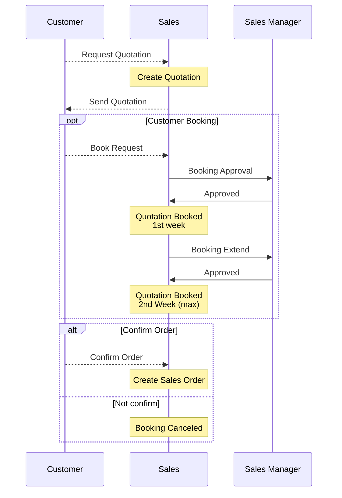
```mermaid
sequenceDiagram
    participant C as Customer
    participant A as Sales
    participant B as Sales Manager

    C-->>A: Request Quotation
    note over A: Create Quotation
    A-->>C: Send Quotation
    opt Customer Booking
        C-->>A: Book Request
        A->>B: Booking Approval
        B->>A: Approved
        note over A: Quotation Booked<br/>1st week
        A->>B: Booking Extend
        B->>A: Approved
        note over A: Quotation Booked<br/>2nd Week (max)
    end
    alt Confirm Order
        C-->>A: Confirm Order
        note over A: Create Sales Order
    else Not confirm
        note over A: Booking Canceled
    end
```

Berikut Menu **Sales Quotation**:

Tombol yang tersedia:

| Tombol   | Keterangan                                                                                                    |
| -------- | ------------------------------------------------------------------------------------------------------------- |
| ShowData | Berfungsi untuk menampilkan list Quotation yang sudah dibuat di sistem ERP sesuai dengan filter yang dipilih. |
| New      | Berfungsi untuk membuat Sales Quotation baru.                                                                 |
| Edit     | Berfungsi untuk mengubah data Sales Quotation yang sudah dibuat.                                              |
| Excel    | Berfungsi untuk export kumpulan data Quotation ke format Excel sesuai dengan filter yang dipilih.             |

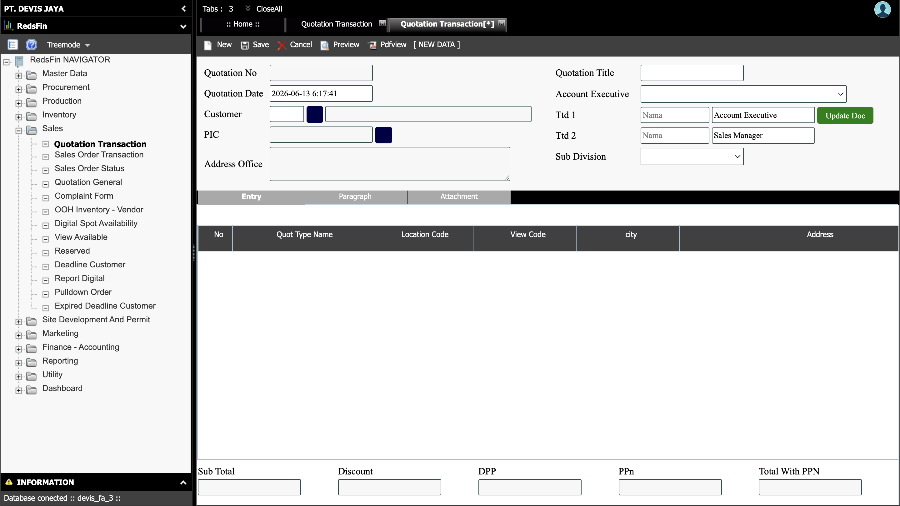

Tombol `New` digunakan untuk membuat Quotation baru. Pada form New, terdapat 2 bagian form, yakni: bagian _Header_ dan bagian _Detail_.

##### Bagian Header

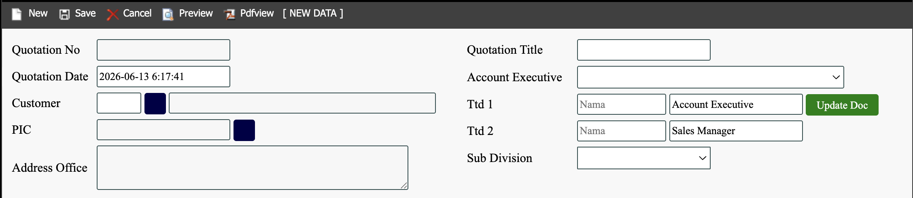

| Field             | Keterangan                                                                                                  |
| ----------------- | ----------------------------------------------------------------------------------------------------------- |
| Quotation No      | Nomor Quotation (autogenerated dari sistem)                                                                 |
| Quotation Date    | Klik untuk memilih tanggal Quotation dibuat                                                                 |
| Customer          | Kode dan Nama Customer, dapat dipilih dari daftar Customer dengan klik tombol hitam di samping.             |
| PIC               | Isi nama PIC Customer yang dapat dihubungi terkait Quotation ini                                            |
| Address Office    | Otomatis terisi sesuai dengan kantor PIC yang dipilih                                                       |
| Quotation Title   | Merupakan judul Quotation yang sedang dibuat                                                                |
| Account Executive | Berisi nama Sales Person dari pihak Devis yang menawarkan Sales Quotation ini                               |
| Ttd 1             | Berisi nama Account Executive yang bertugas                                                                 |
| Ttd 2             | Berisi nama atasan Account Executive yang bertugas                                                          |
| Sub Division      | Berisi divisi Sales Departemen yang terkait atas Quotation yang sedang dibuat (Cigarettes / Non-cigarettes) |

##### Bagian Detail

Bagian Detail terdiri dari 3 bagian (Tab), yakni:

- **Entry**: Bagian Quotation yang berisi View-view yang ditawarkan kepada customer beserta detailnya.
- **Paragraph**: Bagian Quotation yang berisi kepala dan badan surat penawaran, serta syarat dan ketentuan yang berlaku pada Quotation.
- **Attachment**: Bagian Quotation yang berisi lampiran file dokumen pendukung yang berkaitan dengan Quotation tersebut

**Entry**
|Field|Keterangan|
|---|---|
|Dropdown|Berisi jenis Quotation. Terdapat beberapa pilihan, antara lain: <ul><li>New Placement</li><li>Repostering</li><li>Maintenance</li><li>Custom</li><li>Contract Renewal</li><li>Advertising Tax</li></ul>|
|Add Location|Berfungsi untuk menambahkan lokasi & view yang ditawarkan ke customer|
|Delete Location|Berfungsi untuk menghapus lokasi/view yang sudah diinput|
|Delete All Grid|Berfungsi untuk menghapus semua lokasi/view yang sudah dihapus sekaligus|
|List Tabel|Berisi semua lokasi/view yang ditawarkan kepada customer. Untuk detail penawaran terkait lokasi tersebut dapat dilihat dengan double klik pada baris lokasi/view yang ingin dilihat|

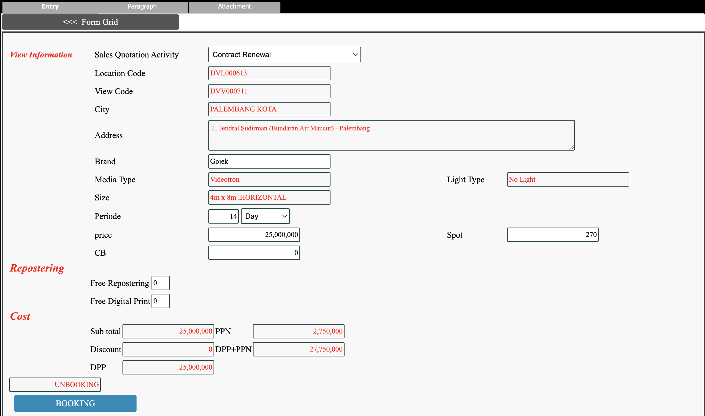

Gambar diatas adalah detail dari lokasi/view yang ditawarkan pada Quotation saat double klik di List Tabel. Pada form ini, user dapat menentukan `Periode` sewa, `Price` dari harga jual, Dan bila media berupa Videotron, maka user dapat mengisi jumlah `Spot` yang ditawarkan.

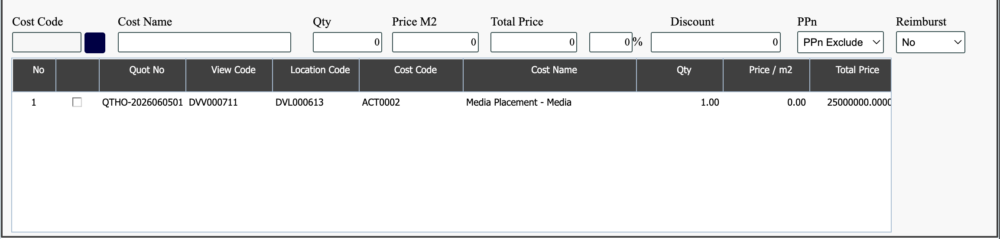

Bagian `Cost` adalah total dari perincian biaya-biaya layanan yang akan menjadikan nilai dari Quotation yang ditawarkan ke customer. User dapat menambahkan komponen `Cost` dan `Harga`, `PPn`, serta keterangan `Reimburse` atau tidak ke customer.

**Alur Penginputan:**

1. Buka Menu _Quotation Transaction_, klik `New`
1. Isi semua data bagian _Header_, kemudian `Save`
1. Setelah `Save`, maka bagian _Detail_ dibawah akan muncul
1. Cari lokasi, klik `Show` dan kemudian pilih lokasi yang diinginkan pada kotak, kemudian klik `Save` dan `Close`
1. Dobel klik pada lokasi yang sudah disimpan
1. Isi semua kolom yang masih kosong dan kemudian klik `Update Information`
1. Isi Nama Cost dan nilainya pada tabel bagian bawah dan klik `Update`
1. Klik `Booking` bila customer sudah memilih lokasi yang ditentukan tersebut
1. `Confirm` oleh Manager
1. `Preview` & Print/download

---

#### 2.2. Sales Order Transaction

**Sales Order** berfungsi untuk pembuatan pesanan dari customer atas penawaran dari Sales Quotation yang sebelumnya sudah ditawarkan kepada customer. Apabila Quotation sudah deal, maka dapat dilanjutkan pada pembuatan **Sales Order**.

Berikut adalah flowchart untuk alur dari **Sales Order** ke departemen lainnya:

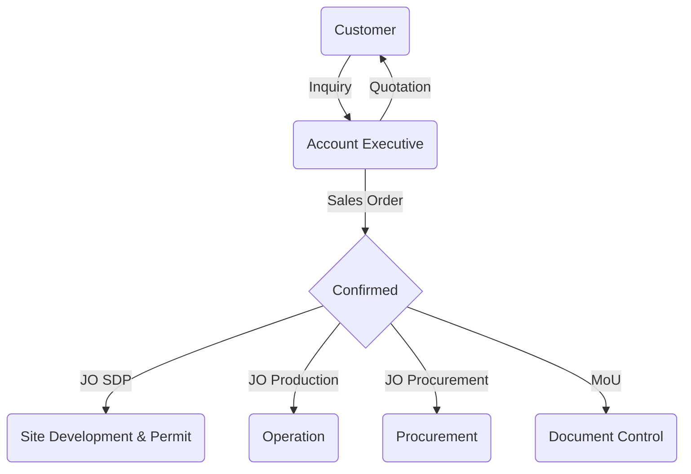
```mermaid
flowchart TD
    A(Customer) -->|Inquiry| B(Account Executive)
    B --> |Quotation| A
    B --> |Sales Order| C{Confirmed}
    C -->|JO SDP| D(Site Development & Permit)
    C -->|JO Production| E(Operation)
    C -->|JO Procurement| F(Procurement)
    C -->|MoU| G(Document Control)
```

Berikut adalah mapping _Job Order_ ke departemen SDP, Operation, Procurement dan Document Control berdasarkan tipe Order di Sales Order:

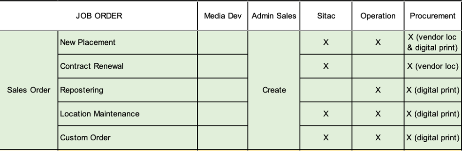

Berikut adalah Menu **Sales Order**:

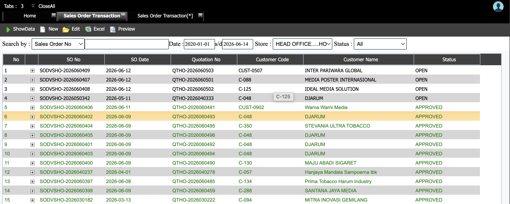

Tombol yang tersedia:

| Tombol   | Keterangan                                                                                                    |
| -------- | ------------------------------------------------------------------------------------------------------------- |
| ShowData | Berfungsi untuk menampilkan list Quotation yang sudah dibuat di sistem ERP sesuai dengan filter yang dipilih. |
| New      | Berfungsi untuk membuat Sales Quotation baru.                                                                 |
| Edit     | Berfungsi untuk mengubah data Sales Quotation yang sudah dibuat.                                              |
| Excel    | Berfungsi untuk export kumpulan data Quotation ke format Excel sesuai dengan filter yang dipilih.             |
| Preview  | Berfungsi untuk mencetak Sales Order dalam format PDF atau cetak ke Printer                                   |

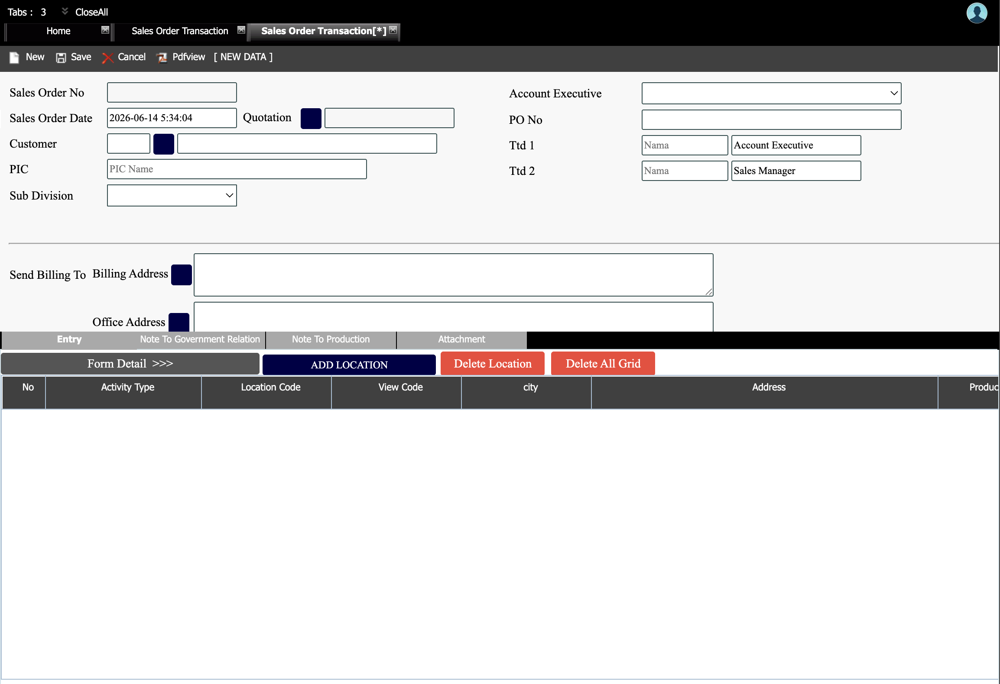

Tombol `New` digunakan untuk membuat Quotation baru. Pada form New, terdapat 2 bagian form, yakni: bagian _Header_ dan bagian _Detail_.

##### Bagian Header

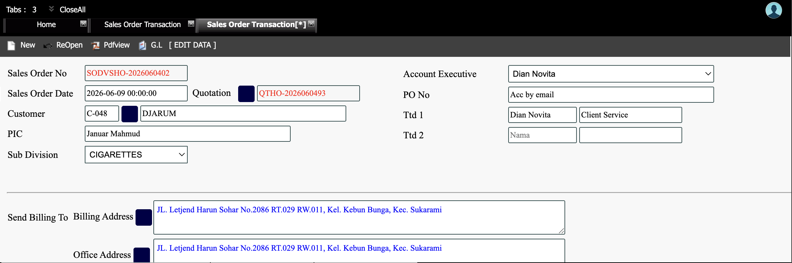

| Field             | Keterangan                                                                                              |
| ----------------- | ------------------------------------------------------------------------------------------------------- |
| Sales Order No    | Nomor Sales Order (autogenerated dari sistem)                                                           |
| Sales Order Date  | Klik untuk memilih tanggal Sales Order dibuat                                                           |
| Customer          | Kode dan Nama Customer, dapat dipilih dari daftar Customer dengan klik tombol hitam di samping          |
| PIC               | Isi nama PIC Customer yang dapat dihubungi terkait Order ini                                            |
| Sub Division      | Berisi divisi Sales Departemen yang terkait atas Order yang sedang dibuat (Cigarettes / Non-cigarettes) |
| Account Executive | Berisi nama Sales Person dari pihak Devis yang menangani Sales Order ini                                |
| PO No             | Nomor PO dari Customer sebagai lampiran referensi                                                       |
| Ttd 1             | Berisi nama Account Executive yang bertugas                                                             |
| Ttd 2             | Berisi nama atasan Account Executive yang bertugas                                                      |
| Billing Address   | Alamat penagihan Customer                                                                               |
| Office Address    | Alamat kantor Customer                                                                                  |

##### Bagian Detail

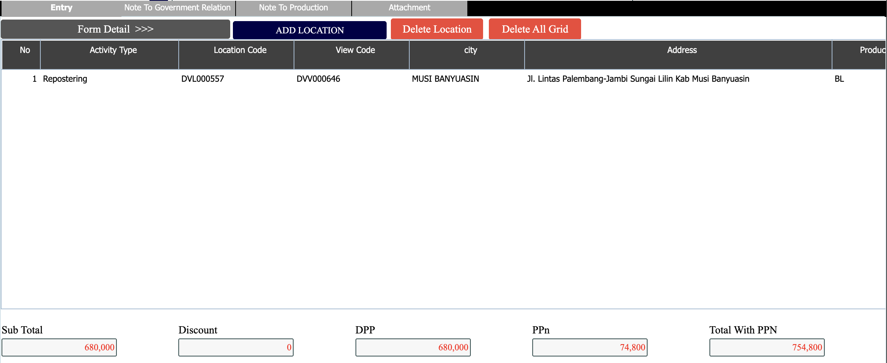

Bagian Detail terdiri dari 4 bagian (Tab), yakni:

- **Entry**: Berisi View-view yang dipesan oleh customer beserta detailnya.
- **Note To Government Relation**: Berisi catatan khusus untuk departemen SDP atas pesanan customer terkait.
- **Note To Production**: Berisi catatan khusus untuk departemen Operation atas pesanan customer terkait.
- **Attachment**: Berisi lampiran file dokumen pendukung yang berkaitan dengan pesanan terkait.

**Entry**
|Field|Keterangan|
|---|---|
|Form Detail|Berfungsi untuk menampilkan detail informasi terkait dengan lokasi View yang dipilih|
|Add Location|Berfungsi untuk menambahkan lokasi & view yang ditawarkan ke customer|
|Delete Location|Berfungsi untuk menghapus lokasi/view yang sudah diinput|
|Delete All Grid|Berfungsi untuk menghapus semua lokasi/view yang sudah dihapus sekaligus|
|List Tabel|Berisi semua lokasi/view yang dipesan oleh customer. Untuk detail lokasi tersebut dapat dilihat dengan double klik pada baris lokasi/view yang ingin dilihat atau melalui tombol `Form Detail`|

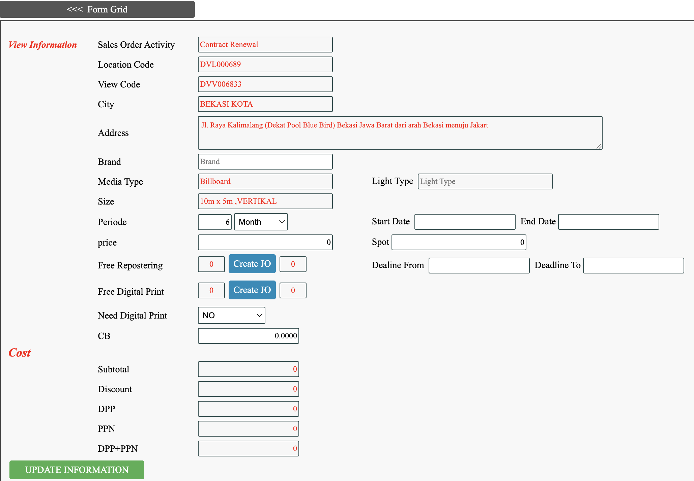

Gambar diatas adalah Form Detail dari view yang ada di List Tabel. Pada form ini dapat dilengkapi informasi Periode sewa, Price, Start Date / End Date, Spot (Digital), Deadline, Free Repostering, Free Digital Print, Need Digital Print, dan CB. Setelah diisi, maka klik `UPDATE INFORMATION` untuk simpan data.

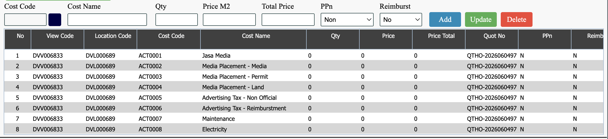

Bagian bawah merupakan komponen harga dari Sales Order. Sama seperti Quotation, Cost Code dapat diisi dan disimpan. (Tombol `Add` untuk menambah Cost ke tabel, `Update` untuk mengubah Cost, dan `Delete` untuk menghapus)

#### 2.3. Sales Order Status

**Sales Order Status** berfungsi untuk memantau progress dari masing-masing Sales Order yang ada di sistem dari masing-masing departemen terkait.

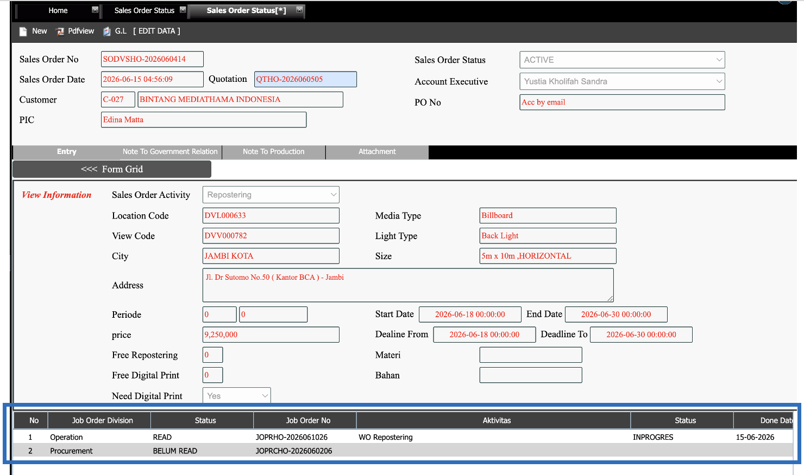

Pada bagian tabel paling bawah (highlight) dapat dilihat per masing-masing View yang dipesan customer terkait Sales Order tersebut, untuk masing-masing pengerjaan oleh departemen terkait akan terlihat statusnya dan tanggal selesainya.

#### 2.4. Quotation General

**Quotation General** berfungsi untuk membuat template Quotation yang diperuntukkan kepada customer tertentu yang membutuhkan bentuk yang berbeda dengan Quotation template biasanya.

##### Daftar Quotation General

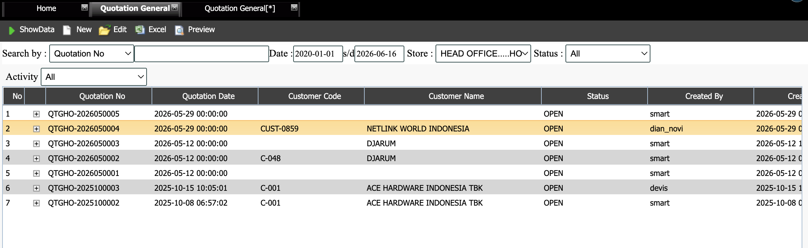

##### Form Quotation General Builder

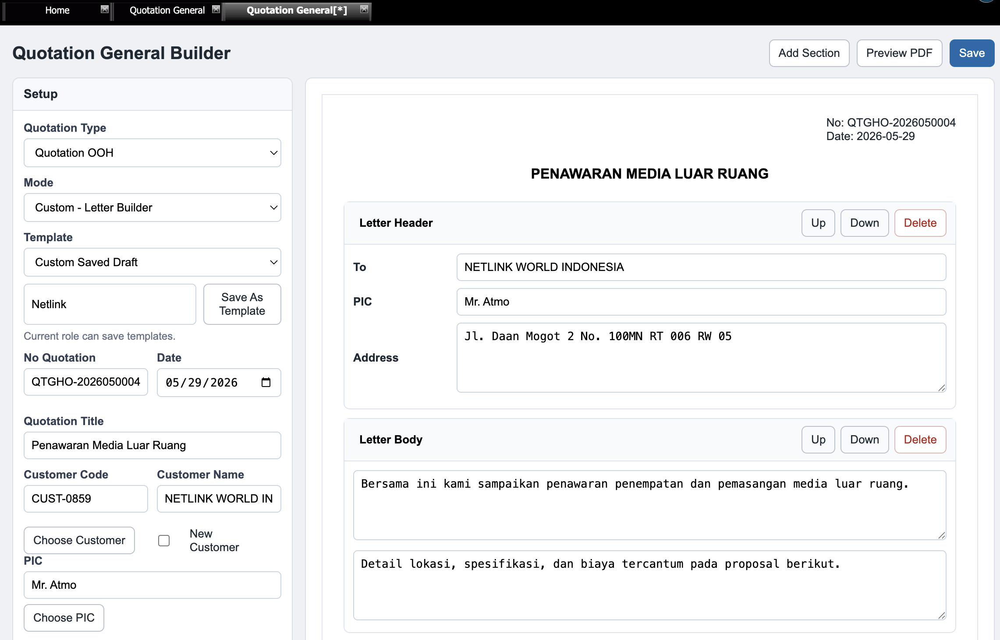
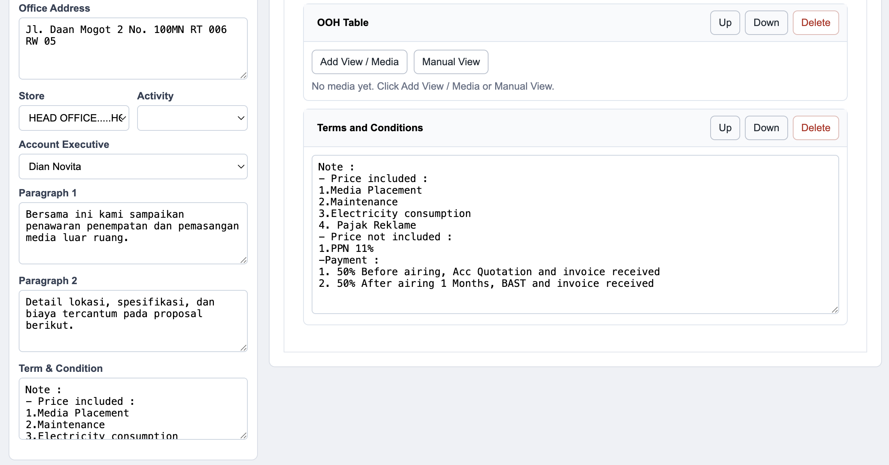

#### 2.5. Complaint Form

**Complaint Form** berfungsi untuk mencatat dan menindaklanjuti keluhan customer atas View yang sedang disewakan oleh beberapa masalah, misalnya: terhalang oleh pepohonan, media iklan robek/rusak, atau lain-lain. _Customer_ akan menghubungi _Account Executive_ untuk menyampaikan keluhannya dan _Account Executive_ akan mencatat ke **Complaint Form** untuk ditindaklanjuti oleh departemen _Operation_ dan departemen lainnya yang berkaitan.

Namun apabila masalah pada View yang ditemukan oleh team internal, maka Team internal dapat mencatat dan menindaklanjuti masalah tersebut melalui **Finding Form** yang ada pada **Modul Production**.

##### Alur Customer Complain & Internal Finding

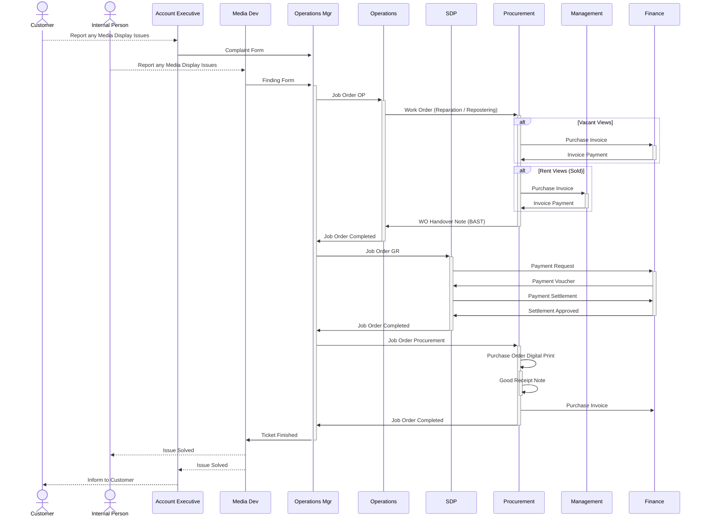
```mermaid
sequenceDiagram
    Actor C as Customer
    Actor O as Internal Person
    Participant AE as Account Executive
    Participant MD as Media Dev
    Participant OM as Operations Mgr
    Participant OP as Operations
    Participant GR as SDP
    Participant PR as Procurement
    Participant MN as Management
    Participant FN as Finance

    C -->> AE: Report any Media Display Issues
    AE ->>+ OM: Complaint Form

    O -->> MD: Report any Media Display Issues
    MD ->>+ OM: Finding Form

    OM ->>+ OP: Job Order OP
    OP ->>+ PR: Work Order (Reparation / Repostering)
    ALT Vacant Views
        PR ->>+ FN: Purchase Invoice
        FN ->>- PR: Invoice Payment
    END
    ALT Rent Views (Sold)
        PR ->>+ MN: Purchase Invoice
        MN ->>- PR: Invoice Payment
    END
    PR ->>- OP: WO Handover Note (BAST)
    OP ->>- OM: Job Order Completed

    OM ->>+ GR: Job Order GR
    GR ->>+ FN: Payment Request
    FN ->> GR: Payment Voucher
    GR ->> FN: Payment Settlement
    FN ->>- GR: Settlement Approved
    GR ->>- OM: Job Order Completed

    OM ->>+ PR: Job Order Procurement
    PR ->>+ PR: Purchase Order Digital Print
    PR ->>- PR: Good Receipt Note
    PR ->> FN: Purchase Invoice
    PR ->>- OM: Job Order Completed

    OM ->>- MD: Ticket Finished
    MD -->> O: Issue Solved

    MD -->> AE: Issue Solved
    AE -->> C: Inform to Customer
```

##### Form List

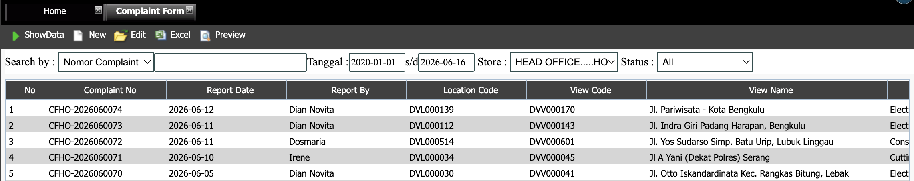

Berikut adalah list Complaint Form yang tercatat pada sistem. User dapat mencari, melihat dan mengubah data komplain pada daftar ini.

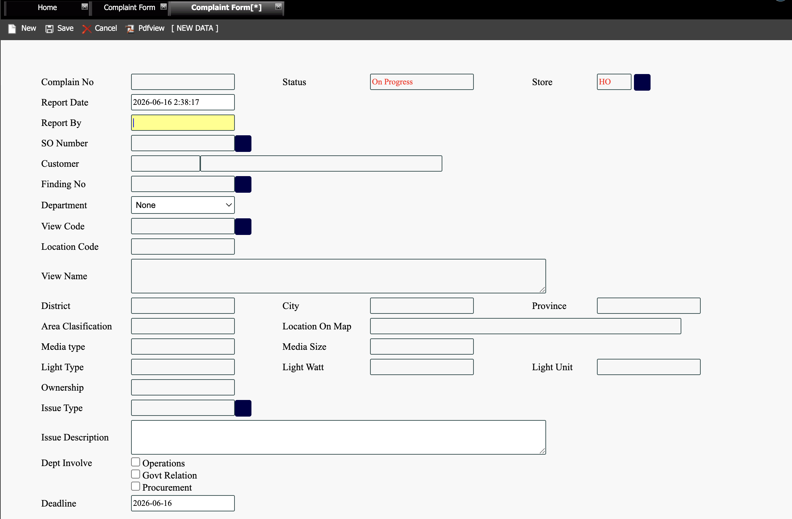

Berikut diatas adalah saat pembuatan Complaint Form baru.

##### Header

| Field             | Keterangan                                                                                                                                                                                         |
| ----------------- | -------------------------------------------------------------------------------------------------------------------------------------------------------------------------------------------------- |
| Complain No       | Nomor Complain (autogenerate oleh sistem)                                                                                                                                                          |
| Report Date       | Tanggal pelaporan isu oleh customer                                                                                                                                                                |
| Report By         | Dilaporkan oleh                                                                                                                                                                                    |
| SO Number         | Nomor Sales Order customer                                                                                                                                                                         |
| Customer          | Kode dan nama customer                                                                                                                                                                             |
| Finding No        | Nomor Finding apabila View tersebut sudah pernah dilaporkan oleh Team Internal                                                                                                                     |
| Department        | Departemen terkait yang menerima keluhan customer                                                                                                                                                  |
| View Code         | Kode View yang dilaporkan                                                                                                                                                                          |
| Location Code     | Kode Location dari view yang berkaitan                                                                                                                                                             |
| View Name         | Nama View yang dilaporkan                                                                                                                                                                          |
| Issue Type        | Jenis issue yang dilaporkan. Pada sistem terdapat beberapa jenis kategori isu yang dapat dipilih, yakni:<ul><li>Construction</li><li>Electrical</li><li>Cutting Tree</li><li>Repostering</li></ul> |
| Issue Description | Uraian detail mengenai keluhan yang dilaporkan oleh customer dan kondisi view saat dilaporkan                                                                                                      |
| Status            | Berisi status Complain                                                                                                                                                                             |
| Store             | Berisi cabang yang berkorelasi dengan view yang dilaporkan                                                                                                                                         |
| Dept Involve      | User dapat menentukan isu ini akan perlu bantuan dari departemen mana saja untuk penanganannya                                                                                                     |
| Deadline          | Merupakan tanggal yang diharapkan isu dapat terselesaikan oleh team terkait                                                                                                                        |

##### Detail

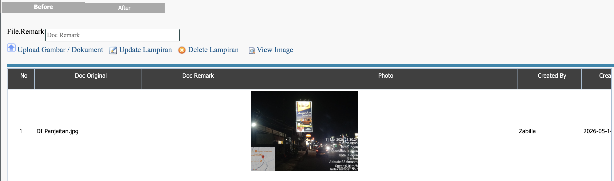

Bagian Detail terdiri dari 2 Tab:

- **Before**: Berisi lampiran dokumen / gambar saat kondisi pelaporan dan sebelum penanganan oleh team.
- **After**: Berisi lampiran dokumen / gambar saat kondisi setelah ditangani dan diselesaikan olen team.

#### 2.6. OOH Inventory - Vendor

Menu ini digunakan untuk melihat semua list Location & View Vendor yang terdaftar di sistem, informasi spesifikasi View, serta mana yang sedang diisi oleh client Devis dan informasi masa berlaku kontraknya.

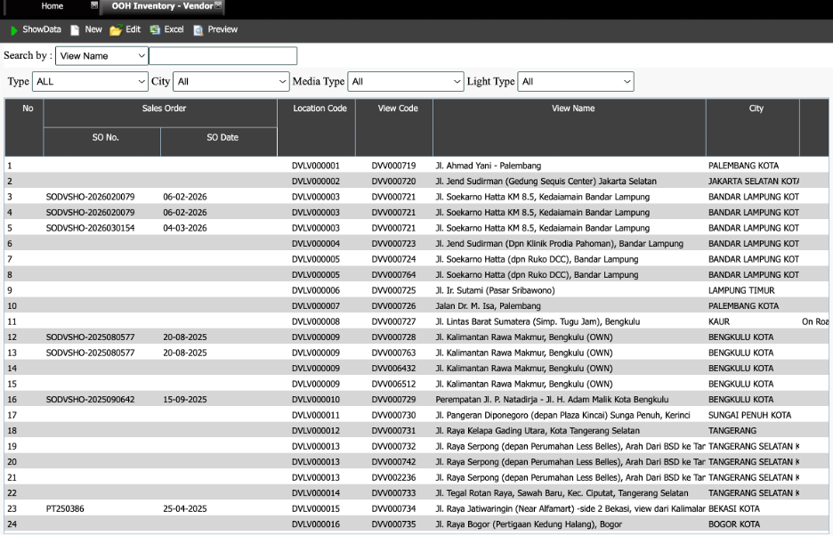

Menu ini menyediakan filter untuk pencarian data berdasarkan View Name, Tipe Static / Digital, Kota, Tipe Media (Billboard, Baliho, dll), dan Light Type.

#### 2.7. Digital Spot Availability

Menu ini digunakan untuk mengetahui ketersediaan View Digital (Videotron) dari rentang tanggal tertentu dan jumlah spot yang dibutuhkan, dan juga dari alamat tertentu. Menu ini membantu Sales untuk mengakses ketersediaan View Digital sesuai dengan kebutuhan customer di waktu tertentu, dengan frekwensi penayangan tertentu dan lokasi tertentu.

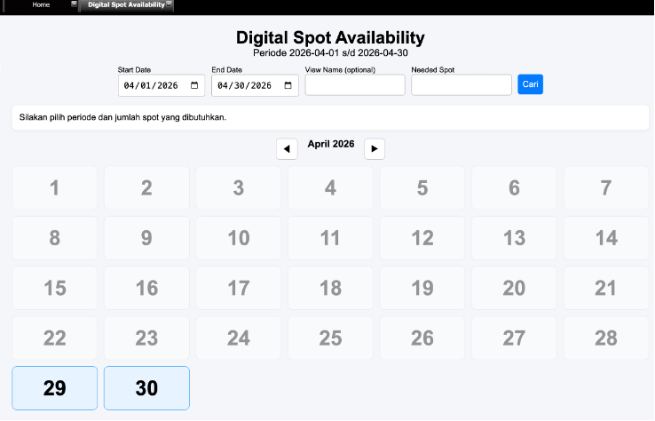

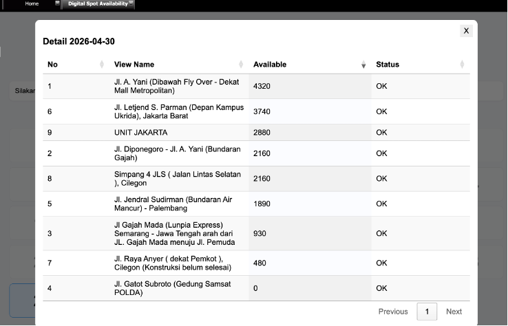

#### 2.8. View Available

Menu ini digunakan untuk mengetahui ketersediaan Location & View Statis, dan Readiness dari masing-masing view tersebut. Menu ini menyediakan berbagai filter navigasi untuk membantu mencari View tertentu dengan berbagai kategori pilihan (by Name, Tipe, Province, City, Media Type, Light Type) dan filter per kolom data.

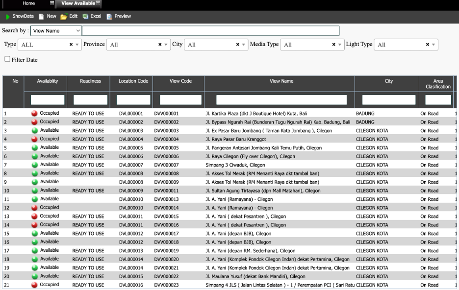

#### 2.9. Reserved

Menu ini digunakan untuk melihat dan memantau Location & View yang sedang di Booking oleh Quotation lain dan mana yang Available untuk ditawarkan kepada calon client. Informasi dilengkapi dengan periode Bookingnya dengan rentang tanggal.

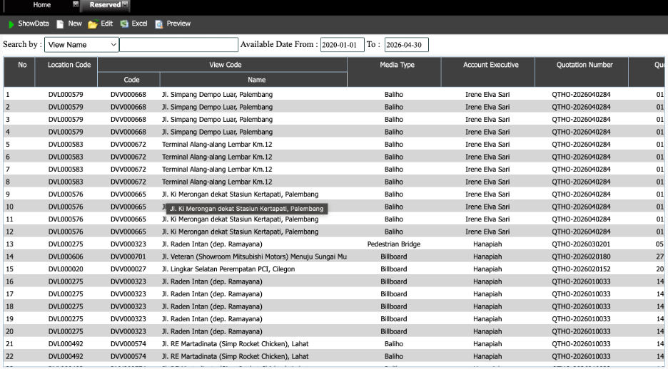

#### 2.10. Deadline Customer

Menu ini digunakan untuk menampilkan informasi dari Sales Order customer yang sedang berjalan / disewa dan akan jatuh tempo habis masa kontraknya. Dari daftar ini, _Account Executive_ dapat menentukan apakah View tersebut akan diperpanjang kontraknya atau tidak diperpanjang maka View tersebut harus dilakukan Pulldown.

Pada menu ini tersedia 2 button:

1. **Renewal**, maka akan membuka menu `Sales Quotation` untuk `Contract Renewal`.
2. **Pulldown**, maka akan membuka menu `Pulldown Order` untuk perintah penurunan media iklan.

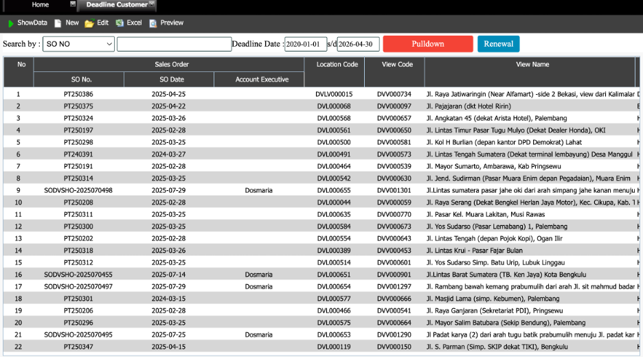

#### 2.11. Report Digital

Menu ini digunakan untuk menampilkan seluruh Location & View tipe Digital dan berikut dengan spesifikasi detail dari View Digital terkait, dan beserta dengan history View tersebut sudah pernah dipesan oleh Customer siapa dan tanggal berapa serta nomor SO-nya dan berapa Spot yang pernah disewa.

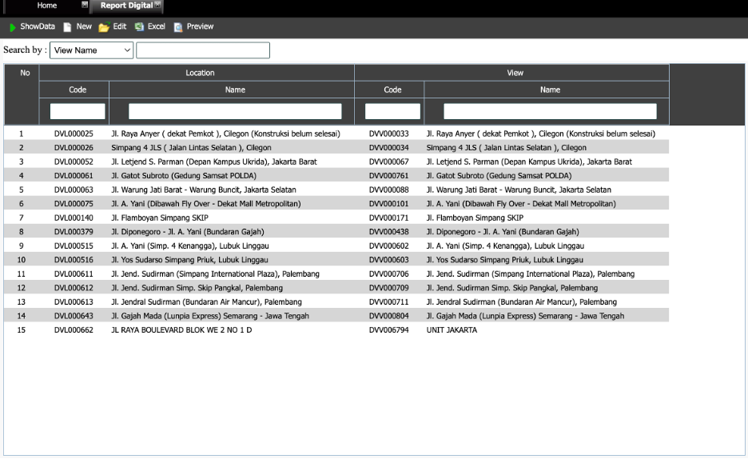

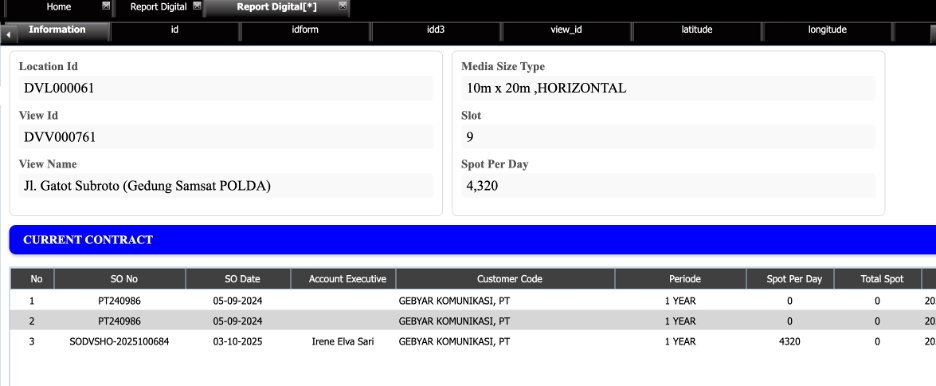

#### 2.12. Pulldown Order

Menu ini digunakan untuk menginisiasi instruksi penurunan media tayang terkait dengan telah berakhirnya masa sewa / kontrak dari Sales Order Customer. Pada form ini, user perlu melengkapi data Location & View, alasan Pulldown, tanggal dilakukan Pulldown, dan tebusan ke departemen terkait (Operations, Gov. Relation, dan Procurement).

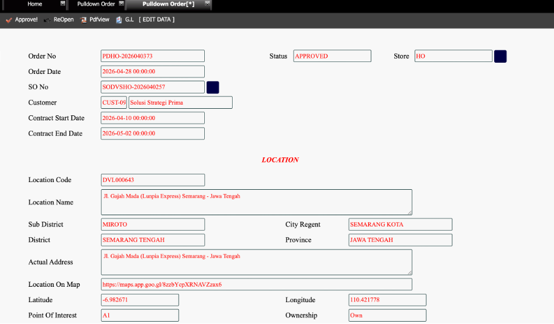

#### 2.13. Expired Deadline Customer

Menu ini digunakan untuk menampilkan informasi daftar Location & View dari Sales Order customer yang sudah melewati masa sewa/kontrak, dan masih belum dilakukan Pulldown Order.

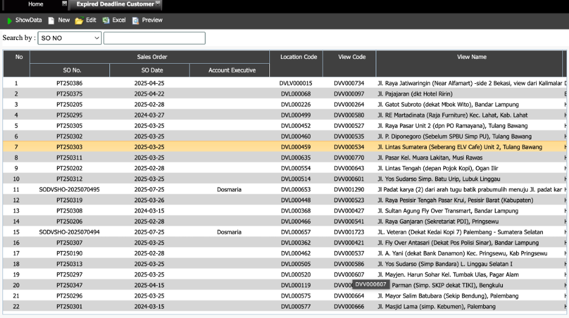

---

### 4. Production

#### Flow WO Repostering

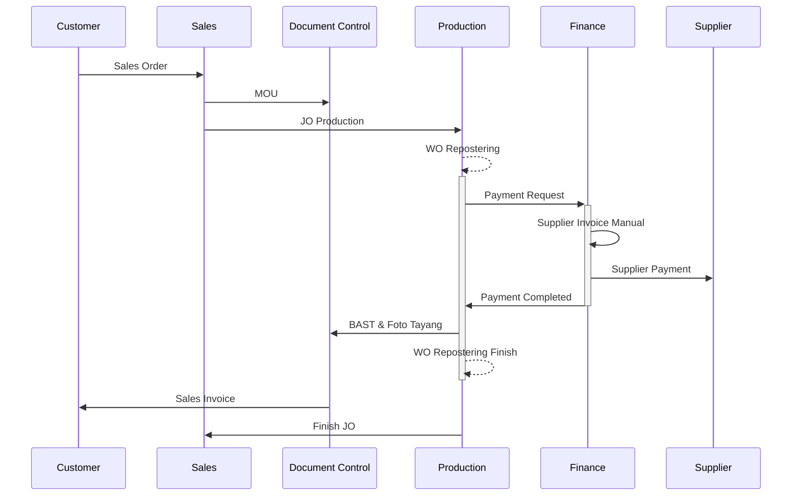
```mermaid
sequenceDiagram
    Participant F as Customer
    Participant D as Sales
    Participant E as Document Control
    Participant A as Production
    Participant B as Finance
    Participant C as Supplier

    F->>D: Sales Order
    D->>E: MOU
    D->>A: JO Production
    A-->>+A: WO Repostering
    A->>+B: Payment Request
    B->>B: Supplier Invoice Manual
    B->>C: Supplier Payment
    B->>-A: Payment Completed
    A->>E: BAST & Foto Tayang
    A-->>-A: WO Repostering Finish
    E->>F: Sales Invoice
    A->>D: Finish JO
```

#### Flow WO Maintenance

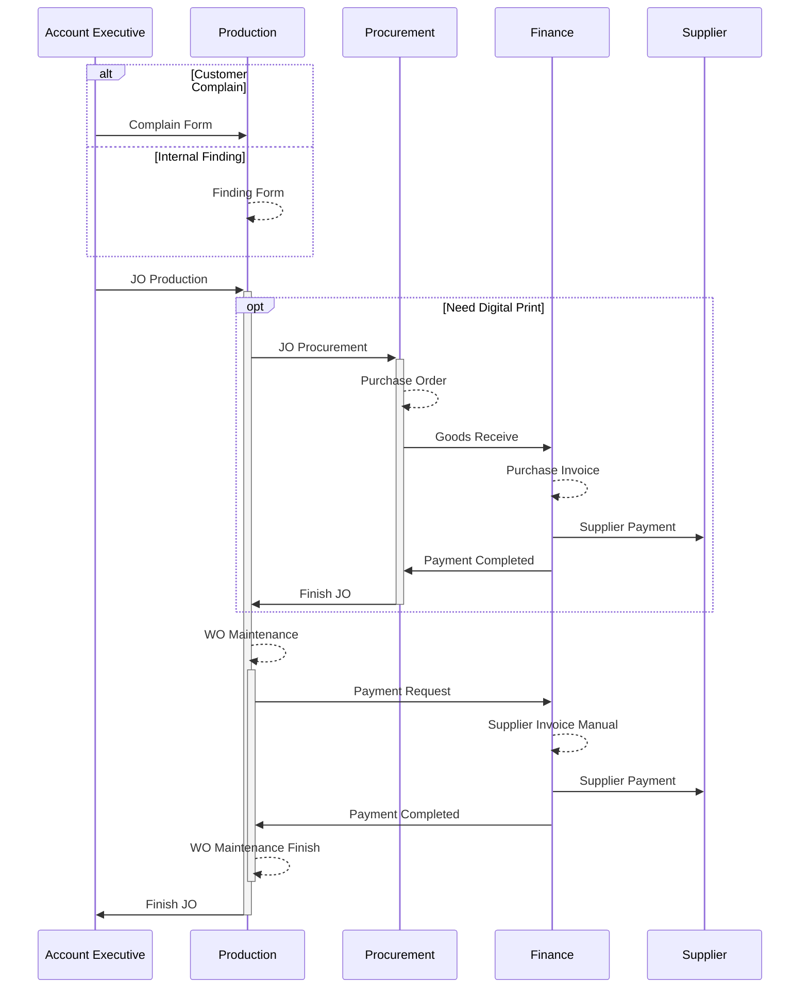
```mermaid
sequenceDiagram
    Participant A as Account Executive
    Participant B as Production
    Participant C as Procurement
    Participant D as Finance
    Participant E as Supplier

    alt Customer Complain
        A->>B: Complain Form
    else Internal Finding
        B-->>B: Finding Form
    end
    A->>+B: JO Production
    opt Need Digital Print
        B->>+C: JO Procurement
        C-->>C: Purchase Order
        C->>D: Goods Receive
        D-->>D: Purchase Invoice
        D->>E: Supplier Payment
        D->>C: Payment Completed
        C->>-B: Finish JO
    end
    B-->>+B: WO Maintenance
    B->>D: Payment Request
    D-->>D: Supplier Invoice Manual
    D->>E: Supplier Payment
    D->>B: Payment Completed
    B-->>-B: WO Maintenance Finish
    B->>-A: Finish JO
```

---

### 6. Site Development & Permit

#### Department Site Development & Permit (SDP), Flow Sewa Lokasi, Advertising Tax & Permit

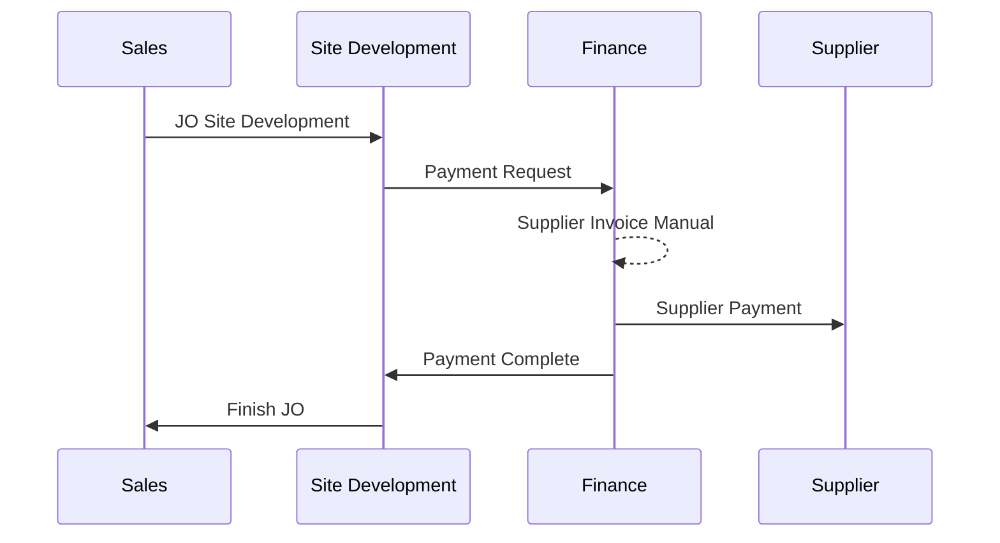
```mermaid
sequenceDiagram
    Participant D as Sales
    Participant A as Site Development
    Participant B as Finance
    Participant C as Supplier

    D->>A: JO Site Development
    A->>B: Payment Request
    B-->>B: Supplier Invoice Manual
    B->>C: Supplier Payment
    B->>A: Payment Complete
    A->>D: Finish JO
```
