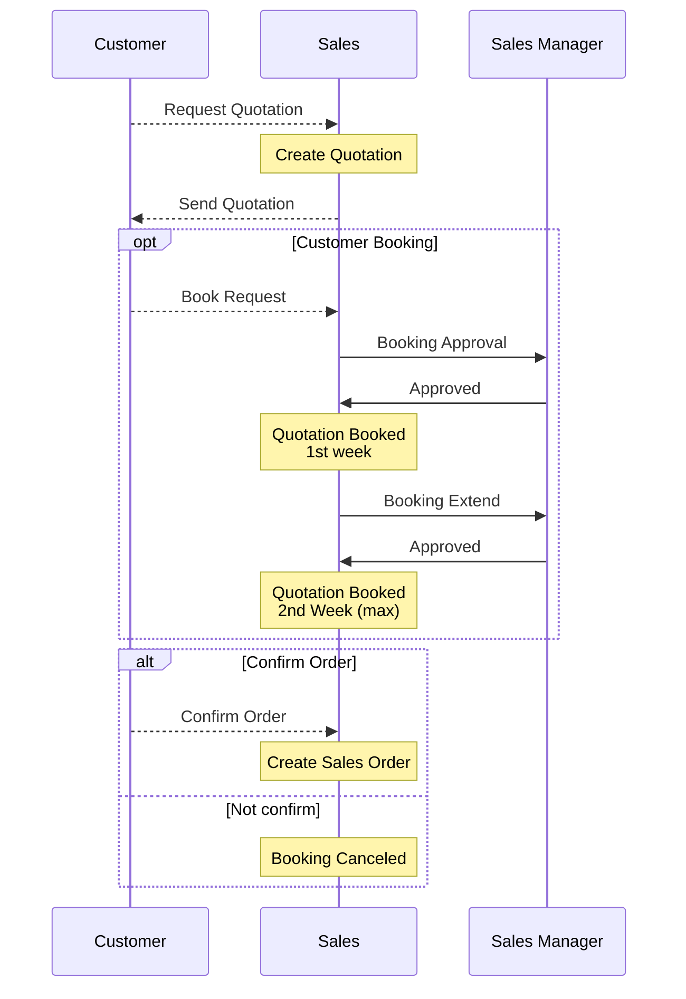
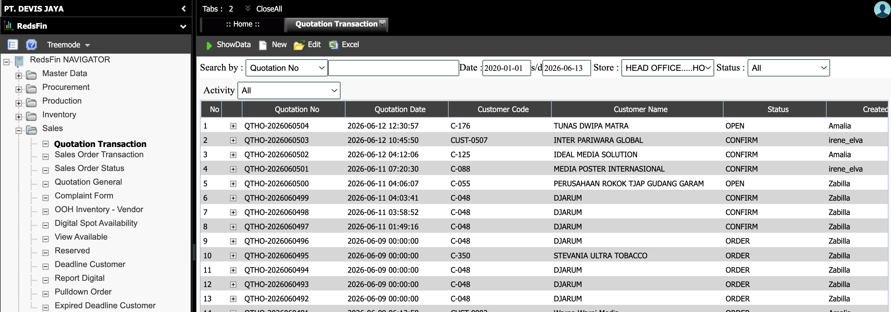
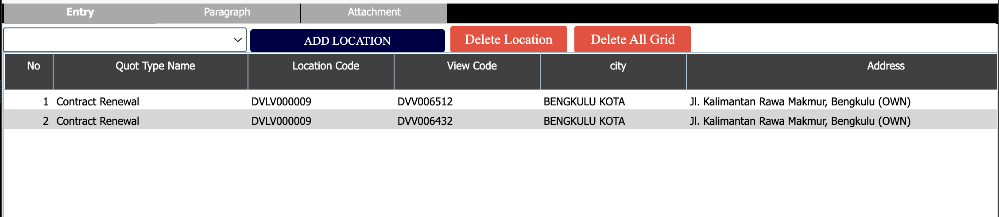

## DEVIS RedsFin ERP

### Documentation

---

DEVIS RedsFin ERP adalah sebuah ERP sistem terpadu yang dikembangkan untuk mendukung operasional dan manajemen perusahaan PT Devis Jaya Advertising.

Adapun modul-modul yang tercakup pada DEVIS RedsFin ERP ini terdiri dari:

1. [Master Data](#1-master-data)
2. [Sales](#2-sales)
3. Procurement
4. Production
5. Inventory
6. Site Development & Permit
7. Marketing
8. Finance Accounting
9. Reporting & Dashboard

---

### 1. Master Data

Master Data berisi semua data master (list/daftar dari komponen entitas) yang berhubungan dengan entitas atau komponen bisnis yang digunakan oleh sistem ERP. Segala entitas dan komponen yang digunakan dalam pencatatan transaksi atau aktivitas bisnis akan didaftarkan pada bagian **Master Data**.

Adapun list/daftar yang tercakup dalam **Master Data** adalah sebagai berikut:

- [Entity](#11-entity)
- [User Management](#12-user-management)
- [Master Site Development & Permit](#13-master-site-development--permit)
- [Master Devis](#14-master-devis)
- [Master Procurement](#15-master-procurement)
- [Master Sales](#16-master-sales)
- [Master Production](#17-master-production)
- [Master Marketing](#18-master-marketing)

---

#### 1.1. Entity

Master Entity adalah master yang berisikan daftar yang berkaitan dengan Perusahaan PT Devis Jaya Advertising. Master Entity terdiri dari:

| Menu              | Keterangan                                |
| ----------------- | ----------------------------------------- |
| Master Company    | Berisi data profil perusahaan             |
| Master Site       | Berisikan daftar Cabang Perusahaan        |
| Master Store      | Berisikan daftar Kantor Cabang Perusahaan |
| Master Department | Berisikan daftar Departemen Perusahaan    |

---

#### 1.2. User Management

User Management berfungsi untuk pengelolaan pengguna sistem ERP, dimana setiap pengguna sistem harus terdaftar pada menu ini dan juga tersedia pengaturan Hak Akses untuk setiap peran dari pengguna dalam sistem ERP.

DEVIS RedsFin ERP memiliki fitur pengaturan pengguna dan hak akses yang lengkap dari setiap peran pengguna akan mendapatkan hak akses pada masing-masing menu detail hingga aktivitas yang dapat dilakukan oleh masing-masing pengguna pada menu tersebut.

| Menu        | Keterangan                                                                                                                                                                                             |
| ----------- | ------------------------------------------------------------------------------------------------------------------------------------------------------------------------------------------------------ |
| Setup Job   | Berfungsi untuk mendefinisikan Peran (Job) yang ada pada sistem sebagai sebuah kelompok pengguna yang menjalankan tugas tertentu pada perusahaan di sistem ERP                                         |
| Setup Users | Berisikan daftar pengguna dan peran (Job) masing-masing dalam sistem ERP, beserta dengan profil pengguna, posisi jabatan, atasan, status, tandatangan, rekening bank, dan daftar cabang yang ditangani |

---

#### 1.3. Master Site Development & Permit

Master ini berfungsi untuk mendaftarkan komponen-komponen bisnis yang berkaitan dengan Lokasi, View, Dimensi-dimensi terkait Lokasi dan View, serta jenis Perizinan.

| Menu            | Keterangan                                                                                                                                                                                                                                         |
| --------------- | -------------------------------------------------------------------------------------------------------------------------------------------------------------------------------------------------------------------------------------------------- |
| Master Grouping | Berisi daftar dimensi atribut dari Lokasi dan View, beserta dengan jenis-jenis isi atribut dari dimensi terkait                                                                                                                                    |
| Master Izin     | Berisi daftar jenis-jenis perizinan yang ada dan ditangani oleh bagian Site Development & Permit di sistem ERP                                                                                                                                     |
| Master Location | Berisi daftar Lokasi Aset Devis (OOH) dan informasi detail terkait lokasi tersebut (misal: Kode, Nama, Alamat, Koordinat, Kota, Propinsi, Kepemilikan, dsb).                                                                                       |
| Master View     | Berisi daftar View yang merupakan komponen OOH terkecil yang merupakan produk yang disewakan oleh DEVIS kepada customer. Masing-masing View memiliki atribut berupa tipe View, Ukuran Media, Tipe Lampu, Jenis dan Kwh Panel Listrik, Gambar, dsb. |

---

#### 1.4. Master Devis

Master ini berfungsi untuk mendaftarkan aktivitas yang berkaitan dengan operasional masing-masing Departemen di sistem ERP.

| Menu                | Keterangan                                                                                                                                       |
| ------------------- | ------------------------------------------------------------------------------------------------------------------------------------------------ |
| Master Job Activity | Berisi daftar pekerjaan yang dapat dilakukan oleh masing-masing Departemen pada sistem ERP (Berkaitan dengan Job Order Masing-masing departemen) |

---

#### 1.5. Master Procurement

Master Procurement berisikan daftar-daftar entitas dan komponen bisnis yang berkaitan/berhubungan dengan departemen Procurement.

| Menu                   | Keterangan                                                                                                                               |
| ---------------------- | ---------------------------------------------------------------------------------------------------------------------------------------- |
| Master Supplier        | Berisi daftar entitas supplier yang berperan sebagai penyedia barang dan jasa yang digunakan oleh perusahaan dalam aktivitas bisnis      |
| Master Supplier-Type   | Berisi daftar kelompok supplier yang berkaitan dengan kelompok pencatatan Hutang pada Akuntansi                                          |
| Master Vinyl Type      | Berisi daftar tipe-tipe Vinyl yang digunakan dalam aktivitas Digital Printing                                                            |
| Master Location Vendor | Berisi daftar Lokasi-lokasi titik vendor rekanan DEVIS, baik yang lama ataupun baru dan dapat digunakan untuk ditawarkan kepada customer |
| Master View Vendor     | Berisi daftar View vendor rekanan DEVIS, baik yang lama ataupun baru dan dapat digunakan untuk ditawarkan kepada customer                |

---

#### 1.6. Master Sales

Master Sales berisikan daftar-daftar entitas dan komponen bisnis yang berkaitan/berhubungan dengan departemen Sales.

| Menu                  | Keterangan                                                                                                                 |
| --------------------- | -------------------------------------------------------------------------------------------------------------------------- |
| Master Customer       | Berisi daftar entitas customer yang membeli atau menyewa produk dari perusahaan dalam aktivitas bisnis                     |
| Master Customer-Type  | Berisi daftar kelompok customer yang berkaitan dengan kelompok pencatatan Piutang pada Akuntansi                           |
| Master Customer Group | Berisi daftar kelompok customer yang berkaitan dengan departemen Sales                                                     |
| Master Salesman       | Berisi daftar Sales Person (Account Executive) dari departemen Sales yang dapat melakukan aktivitas penjualan produk DEVIS |
| Master Sales Activity | Berisi daftar jenis aktivitas penjualan yang tersedia pada sistem ERP                                                      |

---

#### 1.7. Master Production

Master Production berisikan daftar tipe dan tahapan Work Order yang berkaitan dengan departemen Production.

| Menu             | Keterangan                                                             |
| ---------------- | ---------------------------------------------------------------------- |
| Master WO Types  | Berisi daftar jenis-jenis Work Order yang terdapat di sistem ERP       |
| Master WO Stages | Berisi daftar tahapan-tahapan Work Order yang terdapat pada sistem ERP |

---

#### 1.8. Master Marketing

| Menu                     | Keterangan                                                                                                                        |
| ------------------------ | --------------------------------------------------------------------------------------------------------------------------------- |
| Master View Marketing    | Berisi daftar View DEVIS yang dapat digunakan oleh departemen Marketing untuk mengelola Point of Interest pada masing-masing View |
| Master Point of Interest | Berisi jenis-jenis Point of Interest yang dapat didaftarkan pada View DEVIS                                                       |

---

### 2. Sales

Modul Sales berfungsi sebagai entry point utama seluruh proses bisnis di Devis Advertising, dimulai dari penawaran ke customer hingga menjadi order yang akan dieksekusi oleh tim internal (Site Development & Permits, Production, Procurement, Finance, dan Accounting).

Dalam sistem ERP, aktivitas penjualan terdiri dari 5 jenis, yakni:

- New Placement → Pemasangan sewa titik baru
- Contract Renewal → perpanjangan kontrak sewa
- Repostering → pemasangan/penggantian materi iklan
- Location Maintenance → perbaikan / maintenance lokasi customer
- Custom Order → permintaan khusus (non-standar)

Adapun fitur-fitur yang ada pada modul Sales, terdiri dari:

1. [Quotation Transaction](#21-quotation-transaction)
2. Sales Order Transaction
3. Sales Order Status
4. Quotation General
5. Complaint Form
6. OOH Inventory - Vendor
7. Digital Spot Availability
8. View Available
9. Reserved
10. Deadline Customer
11. Report Digital
12. Pulldown Order
13. Expired Deadline Customer

---

#### 2.1. Quotation Transaction

**Sales Quotation** berfungsi untuk pembuatan surat penawaran kepada calon customer atas satu atau beberapa lokasi Devis yang tersedia sebagai tahap awal konfirmasi pesanan dan harga penawaran.

`Account Executive` akan membuat **Sales Quotation** dengan mengisi satu atau beberapa lokasi yang menjadi minat dari calon customer, beserta dengan periode sewa dan harga yang ditawarkan. Sales Quotation dapat digunakan untuk _Booking_ (memesan) lokasi yang tercantum di penawaran agar lokasi tersebut tidak bisa dipesan lagi oleh customer lain. _Booking_ ini bersifat sementara dan berlaku selama 1 (satu) minggu, dan dapat diperpanjang maksimal 1 (satu) minggu berikutnya dengan persetujuan dari `Sales Manager`.

**Sales Quotation** akan di-_confirm_ untuk dapat dilanjutkan ke tahap **Sales Order** apabila customer akhirnya setuju untuk membeli produk yang ditawarkan, atau dapat di-_cancel_ bila customer akhirnya batal.

Berikut alur pada **Sales Quotation**:

Berikut Menu **Sales Quotation**:

Tombol yang tersedia:

| Tombol   | Keterangan                                                                                                    |
| -------- | ------------------------------------------------------------------------------------------------------------- |
| ShowData | Berfungsi untuk menampilkan list Quotation yang sudah dibuat di sistem ERP sesuai dengan filter yang dipilih. |
| New      | Berfungsi untuk membuat Sales Quotation baru.                                                                 |
| Edit     | Berfungsi untuk mengubah data Sales Quotation yang sudah dibuat.                                              |
| Excel    | Berfungsi untuk export kumpulan data Quotation ke format Excel sesuai dengan filter yang dipilih.             |

##### Sales Quotation New

Sales Quotation New digunakan untuk membuat Sales Quotation baru. Pada form New, terdapat 2 bagian form, yakni: bagian `Header` dan bagian `Detail`.

###### Bagian Header

| Field             | Keterangan                                                                                                  |
| ----------------- | ----------------------------------------------------------------------------------------------------------- |
| Quotation No      | Nomor Quotation (autogenerated dari sistem)                                                                 |
| Quotation Date    | Klik untuk memilih tanggal Quotation dibuat                                                                 |
| Customer          | Kode dan Nama Customer, dapat dipilih dari daftar Customer dengan klik tombol hitam di samping.             |
| PIC               | Isi nama PIC Customer yang dapat dihubungi terkait Quotation ini                                            |
| Address Office    | Otomatis terisi sesuai dengan kantor PIC yang dipilih                                                       |
| Quotation Title   | Merupakan judul Quotation yang sedang dibuat                                                                |
| Account Executive | Berisi nama Sales Person dari pihak Devis yang menawarkan Sales Quotation ini                               |
| Ttd 1             | Berisi nama Account Executive yang bertugas                                                                 |
| Ttd 2             | Berisi nama atasan Account Executive yang bertugas                                                          |
| Sub Division      | Berisi divisi Sales Departemen yang terkait atas Quotation yang sedang dibuat (Cigarettes / Non-cigarettes) |

###### Bagian Detail

| Field     | Keterangan                                                                                                            |
| --------- | --------------------------------------------------------------------------------------------------------------------- |
| Tab Entry | Bagian Quotation yang berisi View-view yang ditawarkan kepada customer beserta detailnya                              |
| Paragraph | Bagian Quotation yang berisi kepala dan badan surat penawaran, serta syarat dan ketentuan yang berlaku pada Quotation |
